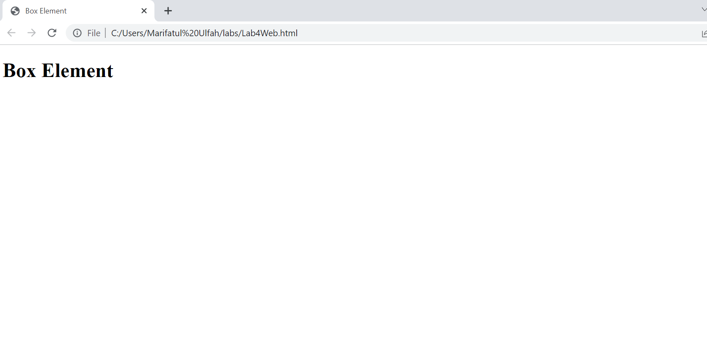
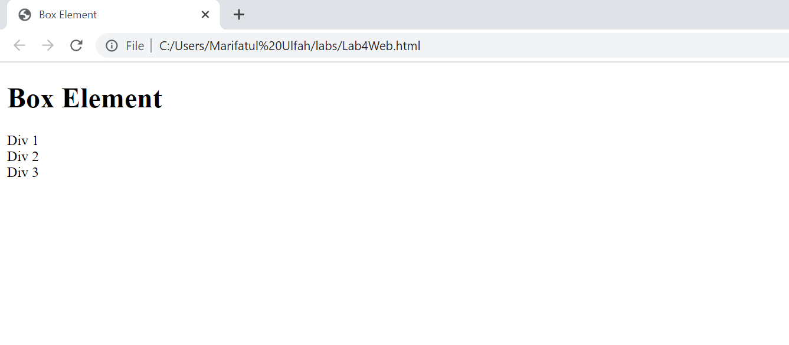
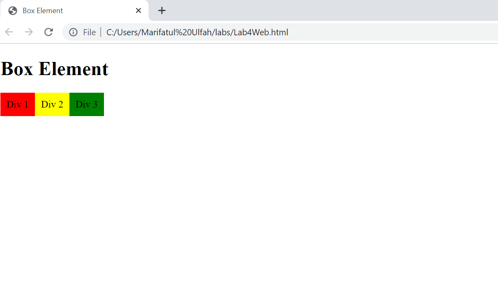
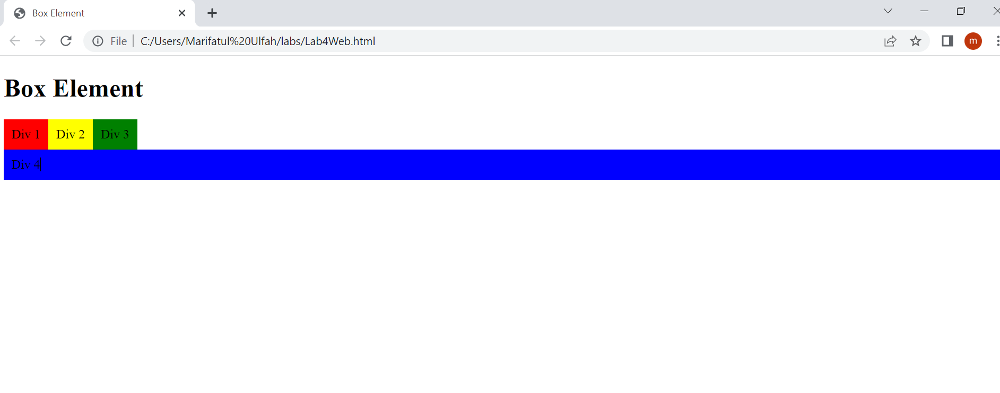
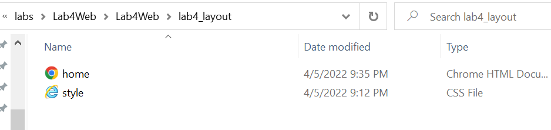
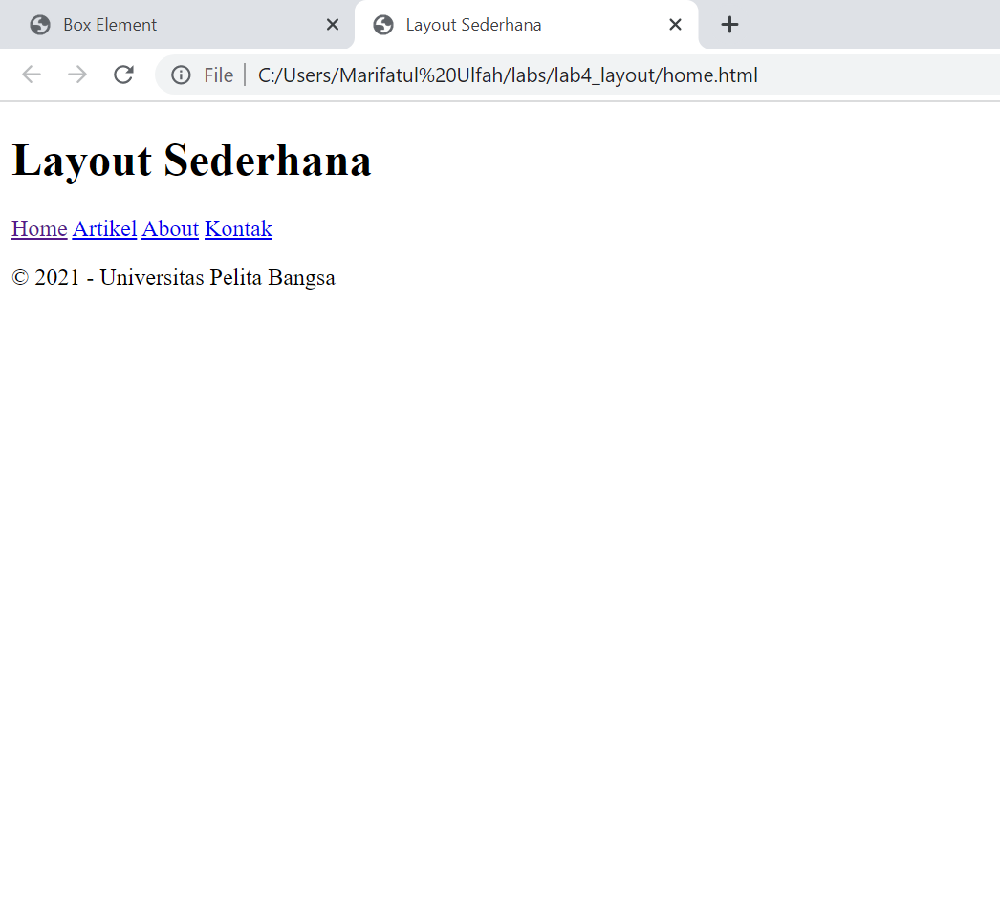

# Lab4Web
Web Layout

# menampilkan layout
output deklarasi tag div 

# CSS Float Property
tanpa float property
yaitu perintah untuk memanggil css style 
source code nya aadalah 
Div 1

hasil output setelah chrome di refresh

# mengatur Clearfix Element
property clear digunakan untuk mengatur property pada css.untuk menampilkan atau memanggil property tambahkan float property nya
hasil chrome setelah di refresh

# layout sederhana
langkah selanjutnya adalah membuat layout sederhana. Dengan membuat folder baru dengan nama lab4_layout kemudian buat file didalamnya dengan nama home.html dan file css dengan nama style.css
seperti gambar dibawah ini:

setelah membuat folder isi home.html dengan source code dengan menambahkan link css, dengan perintah <link rel="stylesheet" href="style.css"> agar file css dan home.html saling terhubung
